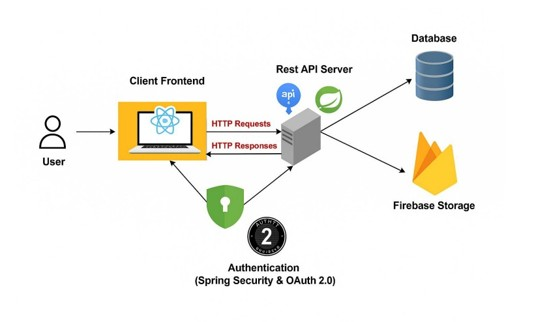

# UniSpace Hub — Smart Campus Operations Platform

**A full-stack web application to modernize university facility management and maintenance workflows.**

## Project Overview

UniSpace Hub is a comprehensive smart campus platform that digitizes facility bookings, asset management, and maintenance incident handling. It provides a centralized system for students, technicians, and administrators to manage campus resources efficiently.

**Developed as part of IT3030 – Programming Applications and Frameworks (Semester 1, 2026)** at **Sri Lanka Institute of Information Technology (SLIIT)**.

## My Role & Contribution

I had **end-to-end ownership** of the **Maintenance & Incident Ticketing Module** — one of the core and most complex parts of the system.

### Key Achievements

- Designed and implemented the complete **ticket lifecycle**:  
  `OPEN → IN_PROGRESS → RESOLVED → CLOSED` (with REJECTED & CANCELLED paths)
- Developed SLA Monitoring Dashboard:
  - Tracks Time to First Response and Time to Resolution
  - Automatically identifies high-risk and breached tickets
  - Helps administrators and technicians prioritize urgent maintenance issues
- Built ticket creation with categories, priorities, descriptions, and facility linking
- Implemented technician claiming, status updates, resolution notes, and comment system
- Secure image attachment system (max 3 files per ticket) using Cloudinary
- Designed and exposed RESTful APIs with proper validation and error handling

## Tech Stack

| Layer       | Technologies |
|-------------|--------------|
| **Frontend** | React 19, Vite, React Router, Axios, Context API |
| **Backend**  | Java 17, Spring Boot 4, Spring Security 6, Spring Data JPA, Hibernate |
| **Database** | MySQL (Aiven Cloud) |
| **Cloud**    | Cloudinary (attachments), Microsoft Entra ID / Google OAuth 2.0 |
| **Others**   | Git, GitHub Actions, Postman, ZXing (QR codes) |

## System Architecture

**Three-tier Architecture:**
- React Frontend → Axios → Spring Boot REST API → JPA/Hibernate → MySQL
- Cloudinary for media storage
- OAuth 2.0 authentication

## Project Links

- **Original Group Repository**: [https://github.com/ChirathDeSilva/UniSpace-Hub](https://github.com/ChirathDeSilva/UniSpace-Hub)
- **Final Project Report**: [Download PDF](Documents/PAF_Final_Report_Y3S1-WD-109.pdf)

## Features Implemented (My Module)

- Full maintenance ticket workflow
- SLA monitoring and deadline tracking
- Comment system with ownership rules
- Secure file uploads with Cloudinary
- Server-side validation and atomic operations (e.g., concurrent ticket claiming)

## Testing & Quality

- Backend unit & integration tests
- Comprehensive Postman API testing 
- Git-based version control

## Note

This repository is a **personal showcase** of my individual contribution and project documentation.  
The original collaborative group repository can be found [here](https://github.com/ChirathDeSilva/UniSpace-Hub).

---

**Author**  
**Ishoda Moderage**  
BSc (Hons) Information Technology, Specializing in Data Science  
Sri Lanka Institute of Information Technology (SLIIT)  
